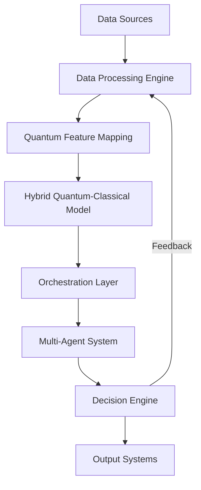

# Quantum Neural Orchestrator


An advanced quantum-inspired neural architecture for multi-dimensional data processing and autonomous system orchestration.

## Overview

Quantum Neural Orchestrator (QNO) is a cutting-edge framework that combines:
- Quantum-inspired neural networks
- Advanced machine learning pipelines
- Autonomous multi-agent orchestration
- Distributed system management

This project explores novel approaches to AI by integrating quantum computing principles with classical machine learning techniques.

## Architecture



## Key Features

### 1. Quantum-Inspired Neural Networks
- Complex-valued neural network layers
- Quantum feature mapping for classical data
- Hybrid quantum-classical model architectures

### 2. Advanced Machine Learning Engine
- Comprehensive data processing pipeline
- Feature engineering and augmentation
- Quantum-inspired data encoding

### 3. Autonomous Orchestration System
- Multi-agent coordination framework
- Task scheduling and distribution
- System health monitoring
- Decision-making engine

## Installation

```bash
# Clone the repository
git clone https://github.com/Luv-Goel/quantum-neural-orchestrator.git
cd quantum-neural-orchestrator

# Create a virtual environment
python -m venv venv
source venv/bin/activate  # On Windows use `venv\Scripts\activate`

# Install dependencies
pip install -r requirements.txt
```

## Usage

### Quantum Neural Network

```python
from src.quantum_core.qnn_module import build_hybrid_model

# Create a hybrid quantum-classical model
model = build_hybrid_model(input_shape=(10,), num_classes=3)
model.summary()
```

### Data Processing

```python
from src.ml_engines.data_processor import DataProcessor

# Load and preprocess data
processor = DataProcessor()
data = processor.load_data('data.csv')
X_train, X_test, y_train, y_test = processor.preprocess(data, target_column='target')
```

### Orchestration System

```python
from src.orchestration_layer.orchestrator import Orchestrator

# Create and manage an orchestration system
orchestrator = Orchestrator()
orchestrator.add_agent("agent_1", ["machine_learning"])
orchestrator.submit_task("train_model", priority=1)
```

## Project Structure

```
quantum-neural-orchestrator/
├── src/
│   ├── quantum_core/          # Quantum-inspired neural network components
│   │   ├── qnn_module.py       # Core QNN implementations
│   │   └── README.md
│   ├── ml_engines/            # Machine learning engines
│   │   ├── data_processor.py   # Data processing pipeline
│   │   └── README.md
│   └── orchestration_layer/   # Autonomous orchestration system
│       ├── orchestrator.py    # Multi-agent orchestration
│       └── README.md
├── docs/                      # Documentation
│   └── architecture/
│       └── README.md
├── tests/                     # Unit and integration tests
│   └── README.md
├── examples/                  # Example notebooks and scripts
├── requirements.txt           # Project dependencies
└── README.md                  # Project documentation
```

## Examples

Check out the [examples](examples/) directory for:
- Quantum neural network training
- Data processing pipelines
- Multi-agent system simulations

## Contributing

Contributions are welcome! Please see our [contribution guidelines](CONTRIBUTING.md) for more details.

## License

This project is licensed under the MIT License - see the [LICENSE](LICENSE) file for details.